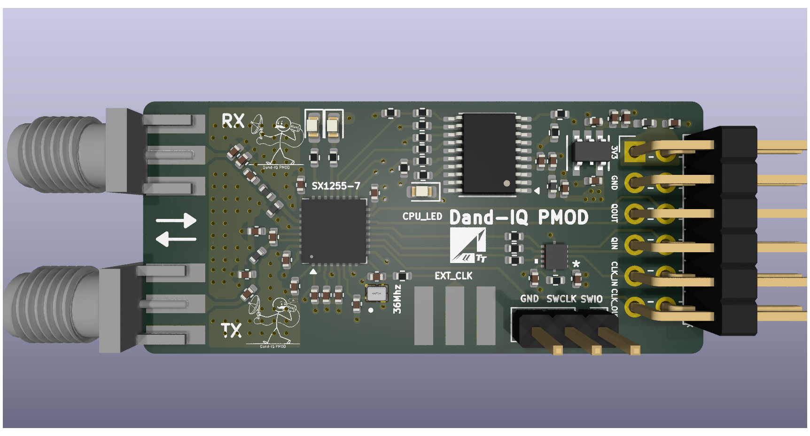
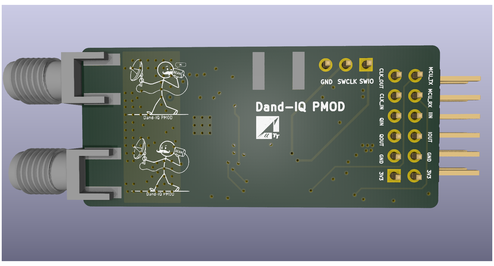
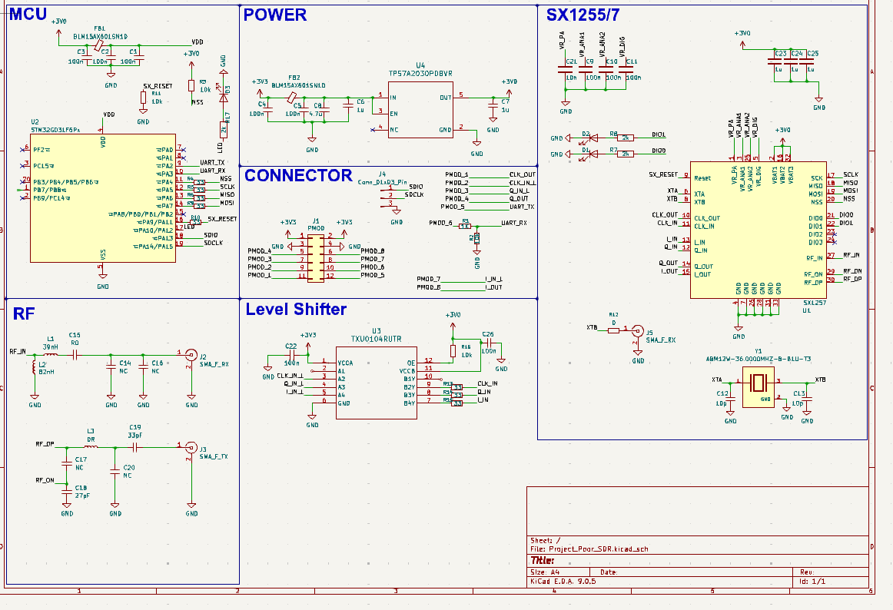
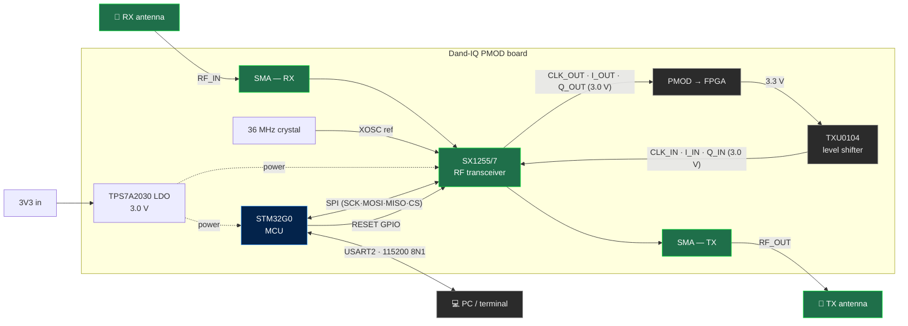
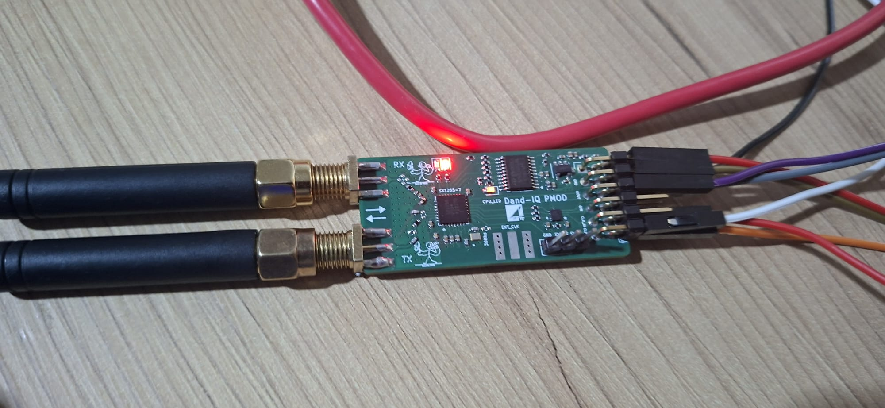
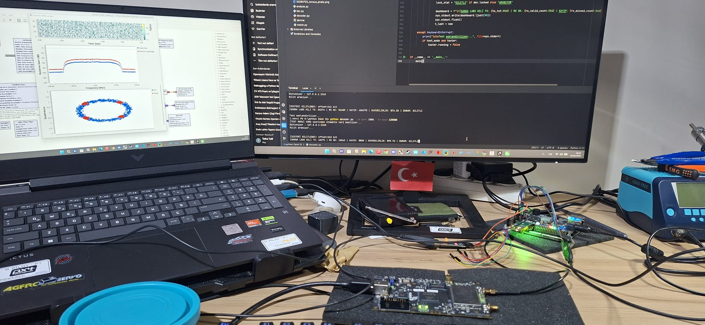
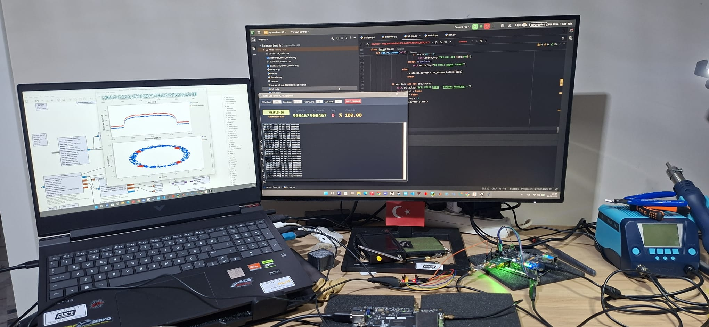

<div align="center">



# Dand-IQ PMOD

### SX1255-based full-duplex IQ SDR front end · STM32 control console · VHDL QPSK transmitter


</div>

---

## Overview

A compact I/Q radio front end covering 400–510 MHz, designed from schematic through PCB and bring-up. The Semtech SX1255 provides the LNA, PA driver, mixers, PLLs and ΣΔ ADC/DACs. An STM32G0 configures it over SPI and exposes every setting through a UART console. Raw baseband I/Q goes to an FPGA over PMOD, where all modulation and demodulation happens.

The point of the split is that the **control plane (STM32) and data plane (FPGA) are independent**: changing frequency, gain or mode is one console command and never touches the bitstream. Integrated platforms like the Pluto or bladeRF don't offer that separation.

Both layers are in this repository. **What works today:** text typed into the UART is framed on the FPGA, gets a CRC32, is QPSK-modulated and transmitted at 433 MHz through the SX1255, then decoded by an SDR on the other side. End-to-end BER is **< 2.1 × 10⁻⁷** over 4.8 M bits with zero errors.

Everything in the signal chain — framing, CRC32, differential QPSK, ΣΔ modulation — is hand-written VHDL. No off-the-shelf modem IP.

<table>
<tr>
<td align="center" width="50%"><b>Front</b><br></td>
<td align="center" width="50%"><b>Back</b><br></td>
</tr>
</table>

---

## Repository layout

```
.
├── docs/                             → usage & code guides, board renders, schematic
│   ├── KULLANIM.md                   → console usage guide (TR)
│   └── KOD_REHBERI.md                → firmware code walkthrough (TR)
│
├── firmware/
│   └── stm32g031/                    → STM32CubeIDE project — SX1255 control console v7.0
│       ├── G031F6P6.ioc              → CubeMX configuration
│       └── Core/Src/main.c           → the console itself
│
├── fpga/
│   ├── rtl/
│   │   ├── uart/                     → tt_uart_rx, uart_rx_wrapper
│   │   ├── framing/                  → prbs_byte_gen, framer, crc, crc32_wrapper, serializer
│   │   ├── modem/                    → qpsk_mapper, qpsk_axis_wrapper, sd_mod1, sd_dac_axis_wrapper
│   │   └── common/                   → event_generator, power_on_reset, not_rst
│   ├── bd/design_1/                  → design_1 block design (Vivado 2023.2)
│   ├── constraints/dand_iq.xdc       → Z-Turn V2 pin & timing constraints
│   ├── ip/rrc_0p35_4x_129tap.coe     → RRC coefficients for fir_compiler
│   └── scripts/create_project.tcl    → regenerates the whole Vivado project
│
├── gnuradio/
│   ├── dandiq_rx.grc                 → receiver flowgraph (GNU Radio 3.10)
│   └── LICENSE.learnSDR              → upstream MIT notice for the flowgraph
│
└── tools/                            → host-side utilities, see tools/README.md
    ├── hil_gui.py                    → hardware-in-the-loop testbench (serial TX + UDP RX)
    ├── decoder.py                    → the same loop on the command line, with CRC32
    ├── ber.py                        → BER / PER measurement
    └── analyze.py, watch.py          → logic-analyzer ΣΔ capture analysis
```

The block design (`design_1.bd`) is the source of truth for the top level; Vivado's generated output around it (`ip/`, `hdl/`, `synth/`) and everything else it produces (`build/`, `*.runs`, `*.cache`, `*.gen`, `.xpr`, bitstreams), plus CubeIDE `Debug/`, are **not** tracked — the project is rebuilt from source, see [Building](#building).

---

## Hardware

| Block | Part | Role |
|------|-------|--------|
| RF transceiver | Semtech **SX1255/7** | I/Q front end: LNA, PA driver, mixers, RX/TX PLLs, 5th-order CT ΣΔ ADC, FIR-DAC |
| MCU | **STM32G031F6P6** | SX1255 control over SPI, UART console, GPIO reset/CS/LED |
| Reference | 36 MHz crystal (ABM12W) | SX1255 XOSC — basis of all frequency math |
| Level shifter | **TXU0104** | FPGA (3.3 V) → SX1255 (3.0 V) on CLK_IN/I_IN/Q_IN |
| Power | **TPS7A2030** LDO | Clean 3.0 V supply |
| RF connectors | 2 × SMA | Separate RX (`RF_IN`) and TX (`RF_OP/RF_ON`) |
| Digital interface | 12-pin PMOD + 3-pin SWD | IQ/CLK/UART out, power, debug |

RX and TX run full duplex on independent PLLs. The board operates the SX1255 in **Mode A** — no on-chip decimation or interpolation, so the 1-bit ΣΔ I/Q stream reaches the FPGA raw and the entire DSP chain is user-defined.

**RF routing.** The two SMA runs are laid out as grounded coplanar waveguide rather than plain microstrip: ground pour on either side of the trace, and a via fence stitching that pour to the reference plane along the whole length of the line. That keeps the return current directly beside the signal instead of letting it spread across the plane, and the fence between the RX and TX runs stops the transmit path from coupling into the receive path — the two are live at the same time in full duplex, so isolation on the board matters as much as it does in the chip.

The starting point for the form factor was [SX1257-PMOD](https://github.com/xil-se/SX1257-PMOD) by xil-se — see [Credits](#credits).

<details>
<summary><b>📐 Full schematic</b> (click)</summary>

<br>



</details>



**Data path (RX):** SX1255 → `CLK_OUT`, `I_OUT`, `Q_OUT` directly to PMOD at 3.0 V.
**Data path (TX):** FPGA → PMOD → TXU0104 (3.3 V → 3.0 V) → `CLK_IN`, `I_IN`, `Q_IN`. The shifter is input-direction only; routing all three channels through one device bounds their relative skew to the on-chip figure.

<div align="center">

<br><sub>Powered up on the bench — independent RX and TX antennas, PMOD header wired to the FPGA.</sub>
</div>

---

## FPGA transmitter

A QPSK transmitter on a Zynq-7020 (Z-Turn V2), written entirely in VHDL, frames bytes arriving over UART and puts them on air.

```
UART 57600 ──> FIFO ──> framer ──> crc32 ──> serializer ──> QPSK ──> RRC ×4 ──> ΣΔ ──> SX1255
   8N1        128 B    35 byte    +4 byte    8b → 2b      mapper    FIR IP    mod1    I_IN/Q_IN
                                                                                          │
   PRBS ─────────────────┘  (padding)                                                 433 MHz
```

| Module | File | Job |
|-------|------|-----|
| `tt_uart_rx` | `rtl/uart/tt_uart_rx.vhd` | 57600 8N1 receiver, two-stage synchronizer |
| `uart_rx_wrapper` | `rtl/uart/uart_rx_wrapper.vhd` | AXI-Stream wrapper feeding the FIFO, overflow protection |
| `prbs_byte_gen` | `rtl/framing/prbs_byte_gen.vhd` | Free-running 8-bit PRBS, padding for empty frames |
| `framer` | `rtl/framing/framer.vhd` | Frame FSM: sync + INDEX + payload selection |
| `crc` | `rtl/framing/crc.vhd` | CRC-32/ISO-HDLC combinational XOR tree |
| `crc32_wrapper` | `rtl/framing/crc32_wrapper.vhd` | AXI-Stream pass-through plus 4-byte CRC append |
| `serializer` | `rtl/framing/serializer.vhd` | 8 bits → 4 dibits (MSB first), raises the upstream byte request |
| `qpsk_mapper` | `rtl/modem/qpsk_mapper.vhd` | Differential QPSK — constellation rotation, 12-bit I/Q |
| `qpsk_axis_wrapper` | `rtl/modem/qpsk_axis_wrapper.vhd` | AXI-Stream wrapper around the mapper |
| `sd_mod1` | `rtl/modem/sd_mod1.vhd` | 1st-order ΣΔ modulator, 12-bit → 1-bit |
| `sd_dac_axis_wrapper` | `rtl/modem/sd_dac_axis_wrapper.vhd` | AXI-Stream wrapper around the ΣΔ modulator (one per I/Q) |
| `event_generator` | `rtl/common/event_generator.vhd` | 400 kHz (ΣΔ) and 100 kHz (symbol) pulse generation |
| `power_on_reset`, `not_rst` | `rtl/common/` | Power-on reset and polarity inversion |

FIFO (`fifo_generator`) and RRC filter (`fir_compiler`, α=0.35, 129 taps, ×4 interpolation) are Xilinx IP, wired up in the `design_1` block design; everything else is hand-written.

### Clocking

The whole system runs at **36 MHz** off the SX1255's `CLK_OUT`. There is no separate oscillator, so the DAC sample clock and FPGA clock cannot drift relative to each other.

| Point | Rate | Divider |
|-------|-----|-------|
| System clock | 36 MHz | — |
| ΣΔ output | 400 kHz | 36M / 90 |
| Symbol | 100 ksym/s | 400k / 4 (RRC interp) |
| Byte | 25 kByte/s | 100k / 4 (dibit) |
| UART input | 5.76 kByte/s | 57600 / 10 bits |

`36 000 000 / 57 600 = 625` — exact division, so baud error is 0%.

Rate is generated from the **end** of the chain, not the start: every 4 dibits the serializer requests a byte upstream, `crc32_wrapper` either forwards that request or supplies its own byte. No block needs to know its own rate.

The framer consumes 4.3× faster than the UART supplies, so frames fill with PRBS padding when there is no data and **transmission never stops** — which is what keeps the receiver's clock and carrier recovery locked. Padding with zeros instead would collapse QPSK onto a single constellation point, leaving timing recovery with no transitions to feed on.

### Frame format

```
┌────────┬────────┬────────┬──────────────────┬─────────────┐
│ 0x65   │ 0x65   │ INDEX  │ payload 32 byte  │ CRC32 4 byte│
└────────┴────────┴────────┴──────────────────┴─────────────┘
   sync     sync             UART + PRBS pad     little-endian
```

39 bytes total, ≈714 frames/s. `INDEX` says how many payload bytes are real UART data; the rest is padding, so partial frames are usable without waiting for 32 bytes to accumulate. The FIFO level is sampled once as `INDEX` is written and locked for the rest of the frame — otherwise a frame could end up half data and half padding, which the receiver cannot separate.

### Receive chain

```
SX1255 TX ──RF 433 MHz──> bladeRF ──> GNU Radio ──UDP──> tools/hil_gui.py ──> dashboard
                                    (AGC · FLL · timing · Costas · diff dec)
```

`gnuradio/dandiq_rx.grc`: `AGC` → `FLL Band-Edge` → `Skip Head` → `Symbol Sync` → `Constellation Receiver` → `Differential Decoder` → `UDP Sink`. `Symbol Sync` runs as a polyphase matched filter with 32 arms, so it does the RRC filtering itself; `Constellation Receiver` carries its own Costas loop. `Skip Head` drops the first second so the AGC and FLL have settled before the timing and phase loops see anything. The radio is tuned 1 MHz above the carrier to keep its DC spike out of the signal.

The receiver flowgraph is **not** original work — it is lesson 20 of Jason Gallicchio's [learnSDR](https://gallicchio.github.io/learnSDR/) course, *Resolving the Phase Ambiguity and Differential Encoding*, configured for this link. See [`gnuradio/`](gnuradio/) and [Credits](#credits).

<div align="center">

<br><sub>GNU Radio receiver: RRC response, locked QPSK constellation, decoder holding sync.</sub>
</div>

`tools/hil_gui.py` closes the loop end to end: it drives the transmitter through the board's serial port with numbered `GRGA########` packets, takes the demodulated symbol stream back over UDP, and reports lock state, throughput and packet loss live.

Symbol-to-dibit mapping is not known up front — constellation ordering and the Costas loop's phase ambiguity leave 24 possibilities. The tool searches all of them, scoring each by how often `0x65 0x65` lands at the correct frame period; bit alignment falls out of the same search. Once locked it parses frames continuously and re-acquires automatically after 20 consecutive sync failures.

```bash
gnuradio-companion gnuradio/dandiq_rx.grc  # open the receiver, then Run

pip install pyserial numpy pandas matplotlib

python tools/hil_gui.py                    # GUI dashboard; port, baud and rate set in the window
python tools/decoder.py --crc              # same loop on the command line, CRC32 verified
python tools/ber.py --crc --istatistik     # BER / PER
```

`tools/analyze.py` covers the other verification path: it takes a logic-analyzer capture of `CLK_OUT`, `I_OUT` and `Q_OUT`, works out the clock channel and sample rate itself, and recovers the signal by FFT — no FPGA and no SDR receiver involved. `tools/README.md` describes all of them.

---

## Building

### FPGA

Requires **Vivado 2023.2** and a Zynq-7020 part (`xc7z020clg400-1`). The MYIR Z-Turn V2 board file is optional.

```bash
git clone https://github.com/TalhaTelli427/DAND_IQ.git
cd DAND_IQ
vivado -mode batch -source fpga/scripts/create_project.tcl
```

That regenerates the project in `build/`, pulls in the RTL and constraints, adds the `design_1` block design from `fpga/bd/design_1/`, pins the RRC coefficient file to this checkout and sets `design_1_wrapper` as top. Then, in the GUI or in batch:

```tcl
launch_runs impl_1 -to_step write_bitstream -jobs 8
```

### Firmware

Open `firmware/stm32g031/` in **STM32CubeIDE** (File → Open Projects from File System) and build — the CubeMX configuration, HAL drivers and linker script are all in the project.

To port the console into an existing project instead, copy `firmware/stm32g031/Core/Src/main.c` over your generated `main.c` (it is written entirely inside the `USER CODE` blocks) and make sure of the following in CubeMX:

1. **USART2 global interrupt** enabled in NVIC Settings — without it no command is detected.
2. **NSS = Disable** for SPI1 (software CS), CS as a separate GPIO.
3. Serial terminal at **115200 8N1** with **local echo OFF** (the firmware echoes).

`docs/KOD_REHBERI.md` walks through the code; `docs/KULLANIM.md` covers day-to-day console use.

---

## Measured results

| Measurement | Result |
|-------|-------|
| `CLK_OUT` frequency | 36 MHz, confirmed with a logic analyzer |
| XOSC + RX PLL lock | Clean at 433 MHz |
| Over-the-air tone capture | **40 dB SNR**, clean peak at +100 kHz offset |
| I/Q quadrature | Peak changed direction when the tone did ✓ |
| Symbol rate | 100 ksym/s (200 kbit/s raw) |
| Occupied bandwidth | **~135 kHz** — `Rs × (1+α)`, matches theory |
| Constellation | Four clearly separated clusters, Costas locked |
| **BER** | **< 2.1 × 10⁻⁷** — 4.8 M bits, **0 errors** |
| SER | 2.4 M symbols, 0 errors |
| Telemetry | UART text returned bit-exact end to end |
| HIL packet loss | **0 lost / 908 467 packets** (`tools/hil_gui.py`, cabled) |

<div align="center">

<br><sub><code>tools/hil_gui.py</code>: 908 467 packets sent, 908 467 received, 0 lost.</sub>
</div>

> The BER test was run over cable at high SNR. An SNR sweep with a variable attenuator to produce a BER curve is planned.

The raw 1-bit ΣΔ stream can also be captured directly with a logic analyzer and decoded in Python via FFT — receiver verification is possible without an FPGA at all, an unexpected benefit of Mode A.

---

## Using the board

The prompt shows the current mode and frequency, e.g. `[RX 433.000 MHz] >`. Commands are case-insensitive with single-letter shortcuts, and the line editor supports backspace, Ctrl+U and Ctrl+C.

| Command | Description |
|-------|----------|
| `help` \| `?` | Command menu |
| `stat` | Status table: XOSC, PLL RX/TX, PA, MODE, frequencies, gains, chip ID |
| `info` | Register dump 0x00–0x13 (name + hex + binary) |
| `mon on/off` | Per-second automatic status stream |
| `rx on/off`, `tx on/off`, `pa on/off` | Chain enables (disabling TX also drops the PA) |
| `standby` / `sleep` | XOSC only (CLK_OUT keeps running) / everything off |
| `freq <MHz>` | Set both; `freq rx` / `freq tx` set them independently |
| `txpower <0-15>` | Single-knob TX power (DAC + mixer together) |
| `txgain <dac 0-3> <mix 0-15>` | Full TX gain control |
| `rxgain <lna 1-6> <pga 0-15>` | RX gain |
| `rd <addr>` / `reg <addr> <val>` | Raw register read / write with verified read-back |
| `reset` | Manual reset and re-run bring-up |

Setting RX and TX LOs independently matters for IQ calibration — offsetting them puts TX and RX impairments at different frequencies so they separate in a single measurement.

**LNA steps are not uniform:** `1` = 0 dB, `2` = −6, `3` = −12, `4` = −24, `5` = −36, `6` = −48 dB. Back off the PGA first and touch the LNA last — if the signal is strong the distortion happens in the LNA and reducing the PGA won't undo it. Noise figure is 4.5 dB at max LNA gain, 38 dB at minimum.

**Bring-up failures are reported by cause:** no SPI response (`VER=0x00`/`0xFF` → check MOSI/MISO/SCK/CS, supply, RESET), XOSC not locking (check XTA–XTB joints and the 12 pF loading caps), or PLL not holding (confirm the frequency is inside 400–510 MHz).

> 🛡️ **Safe TX order:** `tx on` → `txpower 0` → raise gradually → `pa on`. Never enable the PA without an antenna or 50 Ω dummy load on the TX SMA. The SX1255 can output up to +7 dBm, so insert 30–40 dB of attenuation before any spectrum analyzer, and follow local radio regulations on power, duty cycle and antennas even in the 433 MHz ISM band.

### Pinout

**PMOD (12-pin), per the back-side silkscreen:**

| Row A | `CLK_OUT` | `CLK_IN` | `QIN` | `QOUT` | `GND` | `3V3` |
|--------|:---------:|:--------:|:-----:|:------:|:-----:|:-----:|
| **Row B** | `MCU_TX` | `MCU_RX` | `IIN` | `IOUT` | `GND` | `3V3` |

**SWD (3-pin):** `GND` · `SWCLK` · `SWIO` — **RF:** `RX` SMA (`RF_IN`) · `TX` SMA (`RF_OP`/`RF_ON`)

> ⚠️ Before connecting to an FPGA, confirm the 3V3/GND positions line up with the target header and that the bank's VCCO is 3.3 V. The SX1255 digital I/O runs at 3.0 V; a 1.8 V bank will destroy it.

---

## Next steps

- [ ] Testbenches under `fpga/sim/` (framer, CRC32, ΣΔ) with a CI-runnable script
- [ ] Move to full AXI4-Stream backpressure (`tready` instead of `event_generator`)
- [ ] SNR sweep with a variable attenuator → BER curve
- [ ] RX capture path (CIC → AXI-DMA → PS)
- [ ] IQ/DC offset calibration → 16QAM

## Credits

The board took its starting point from **[SX1257-PMOD](https://github.com/xil-se/SX1257-PMOD)** by xil-se: putting a Semtech I/Q transceiver on a PMOD footprint, with RX and TX brought out to separate SMAs. Dand-IQ is a separate schematic and layout — SX1255/7, an on-board STM32G0 driving SPI directly rather than an SC18IS602B I²C-SPI bridge, a TXU0104 level shifter for the 3.3 V → 3.0 V digital interface, and a TPS7A2030 LDO.

The GNU Radio receiver, `gnuradio/dandiq_rx.grc`, is derived from **[learnSDR](https://gallicchio.github.io/learnSDR/)** — the QPSK modem of lesson 20, *Resolving the Phase Ambiguity and Differential Encoding*. Copyright (c) 2021–2022 Jason Gallicchio and Peter Saeta, MIT-licensed; the upstream notice travels with the file in [`gnuradio/LICENSE.learnSDR`](gnuradio/LICENSE.learnSDR). It was configured for this link — bladeRF source, 200 kSps at 2 samples per symbol, α=0.35 to match the transmitter's RRC, and a UDP sink the host tools read. The transmitter, the firmware and the host tools in this repository are original work.

Xilinx `fir_compiler` and `fifo_generator` are vendor IP; every other HDL module here is hand-written.

## License

Released under the MIT License. See [`LICENSE`](LICENSE).

That covers the work in this repository — the HDL, the console firmware, the host tools and the documentation. It does not cover the third-party code vendored under `firmware/stm32g031/Drivers/`: the STM32 HAL is BSD-3-Clause and CMSIS is Apache-2.0, each keeping its own `LICENSE.txt` alongside the sources.

<div align="center">
<br>
<sub>Dand-IQ PMOD · SX1255 + Zynq-7020 · 433 MHz Mode A · QPSK 100 ksym/s</sub>
</div>
